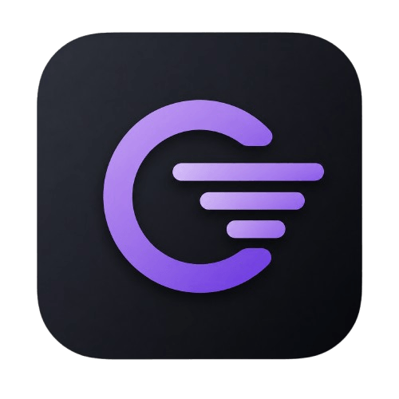

<p align="center">
  
</p>

<h1 align="center">CrowdRelay</h1>

<p align="center">
  <strong>A deterministic growth-operations platform for labels, artist rosters and festivals.</strong>
</p>

<p align="center">
  Business state and business decisions stay in one place. External services only execute the work they're asked to do.
</p>

---

CrowdRelay owns the durable business state behind audience growth and live operations: fans and consent, events, tickets, admission, merch, referrals, venue relationships, community outreach, and every action taken around them. It decides what to do within explicit authority limits, executes through external systems, measures what happened, and feeds results into the next decision cycle.

It is built to run **a whole roster from one seat**: each artist is a workspace inside a label organization, and the portfolio layer lets a roster's audiences amplify each other through explicit, revocable, capped consent edges — the one capability that only exists when one platform holds every artist's fan graph. The first tenant running it in production is Virya; onboarding another act or festival is workspace provisioning, not a fork.

The core is deterministic Rust — state machines, enums, persisted snapshots, explicit conditions, bounded authority, retries and failure handling. It finds opportunities, makes decisions, executes work, survives failures and knows when it's not allowed to act. LLM-assisted creative work (press pitches, social posts, campaign analysis) is layered on top, seeded with real tenant data, never making business decisions itself.

## Ecosystem

| Repository | Stack | Role |
|-----------|-------|------|
| [**crowdrelay**](https://github.com/CrowdRelay/crowdrelay) | Rust, Axum, SQLx, Postgres | Core backend — durable business state, Autopilot engine (21 evaluation contexts), outbox delivery, ad conversion, draws, admission |
| [**crowdrelay-control-plane**](https://github.com/CrowdRelay/crowdrelay-control-plane) | Rust, Axum, SolidJS, Postgres | Operator plane — tenant provisioning, runtime health, deployment identity, audit, agent proxy |
| [**crowdrelay-agents**](https://github.com/CrowdRelay/crowdrelay-agents) | Node.js, TypeScript, Fastify | LLM agent service — press pitches, social posts, campaign analysis seeded with live tenant data |
| [**virya**](https://github.com/CrowdRelay/virya) | Astro, Preact, Tailwind, Stripe | Public website — tickets, merch, fan experiences, AREA game, staff panel |
| [**virya-signal**](https://github.com/CrowdRelay/virya-signal) | Rust, Tauri 2, Leptos | Mobile client — fan wallet, ticket scanning, staff operations, ViryaOS cockpit |
| [**synesthesia**](https://github.com/CrowdRelay/synesthesia) | Godot 4, Rust | Interactive album — playable companion to _Echoes Of The Modern Mind_, eleven rooms with draw entry |

## The Autopilot

Twenty-one bounded contexts evaluated on every cycle, each passing through a shared funnel: confidence gate &rarr; authority level &rarr; class ceiling &rarr; envelope budget &rarr; deliverability halt. The stricter limit wins.

| context | what it handles |
|---|---|
| Ticket Yield | sell-through, paid velocity, capacity moves under guardrails |
| Fan Lifecycle | deterministic communication steps per fan lifecycle stage |
| Campaign Lifecycle | event campaign phases with consent-gated messaging |
| Merchandising | stock coverage, reorder windows, bundle economics |
| Merch Pricing | price moves preserving margin floors |
| Merch Bundle | affinity-based bundle requests |
| Booking Opportunity | city demand scoring, verified outreach targets, cooldowns |
| Outreach | playlist curators, press, radio, creators, media patronage |
| Content Supply | release artifacts, content source verification |
| Promotion Budget | ROAS observation, budget bounds |
| Experimentation | traffic allocation with sufficient-evidence checks |
| Show Operations | task completion proven from system state vs human-required |
| Release | milestones, editorial pitch chase, calendar sync |
| Live Opportunity | gig economics, strategic value, negotiation terms ladder |
| Funding | funding package preparation and submission |
| Beacon | scene-partner discovery, local signal amplification, invite batches |
| Show Growth | free listing sweeps, audience capture, organic channel push |
| Growth Metrics | trend and anomaly detection across metric series |
| Growth Debt | neglected committed work: quiet relationships, missed milestones, missing assets |
| Outreach Supply | detects starved pipelines, requests discovery sweeps |
| Plays | multi-step campaigns with fan anchors and consent re-checks |

## AI Agents

The `crowdrelay-agents` service brings LLM-powered creative work into the same platform that holds the business data. Every task pulls live data from the CrowdRelay database — real event dates, real fan counts, real outreach targets — so the LLM writes about the actual situation, not a template.

- **6 LLM providers**: OpenCode Zen (free, no key), OpenAI, Anthropic (Claude), Google Gemini, Groq, OpenRouter
- **Templates**: press pitch, social post, campaign analysis — more planned
- **Task suggestions**: the engine analyzes tenant data and proactively suggests actionable next steps with one-click execution
- **Model fallback chain**: if the requested model fails, the runner cascades to free-tier models, then other connected providers
- **Per-tenant credentials**: each workspace connects its own providers; API keys are AES-256-GCM encrypted at rest and never sent back to the frontend
- **Workspace-scoped**: all credentials, tasks, results and data access are scoped to a single workspace ID

The control plane proxies requests transparently via HMAC-signed tokens. If the agent service isn't configured, tenant traffic is unaffected.

## Architecture

```
                 ┌──────────────────────────────────────────┐
                 │             CrowdRelay Core               │
                 │         Rust / Axum / Postgres            │
                 │                                          │
                 │   Autopilot (21 contexts)   Fan Graph     │
                 │   Outbox / Delivery         Consents       │
                 │   Ticketing / Merch          Referrals     │
                 │   Ad Conversion (LISTEN)     Draws         │
                 │   Audience Graph             Beacon Net    │
                 └──────┬──────────┬──────────┬──────────────┘
                        │          │          │
              ┌─────────┴──┐  ┌───┴─────┐  ┌──┴──────────────┐
              │  Control   │  │ Agents  │  │    Clients      │
              │  Plane     │  │ (LLM)   │  │                 │
              │            │  │         │  │  virya.music    │
              │ Provision  │  │ Pitch   │  │  Signal (app)   │
              │ Runtime    │  │ Social  │  │  Synesthesia    │
              │ Audit      │  │ Analyze │  │                 │
              └────────────┘  └─────────┘  └─────────────────┘
```

Email, n8n, Stripe, Calendar, Bandsintown and LLM-assisted copy are adapters, not sources of truth. A 200 response proves request handling, not delivery — the transactional outbox owns durability, retries and dead-state inspection.

## Authority model

One dial applies all twenty-one context levels, four class ceilings and the envelope switches atomically. Budgets are operator-tuned and survive posture flips.

| posture | what the engine does | what it never does |
|---|---|---|
| `grounded` | observes and rehearses everything (dry run) | touch anyone |
| `working` | first-party work runs alone; outward contact drafts for approval | send to fans or curators unattended |
| `full_send` | owned audience sends within limits; free pitching runs unattended | spend money, sign contracts |

Money and contracts stay behind approval in every posture.

## Safety

- Deliverability ramp: sending volume earns its ceiling from zero; bounce or complaint rates close it before damage
- Drawdown halts close ordering when losses breach profile limits
- Every action carries an idempotency key; retries are bounded and auditable
- Circuit breakers open on executor failure storms
- Kill switch stops all ordering without touching positions or data
- Blue/green deploys cannot let two workers jointly exceed a quota
- HMAC-signed webhooks with replay protection
- `#![forbid(unsafe_code)]` — runtime panics forbidden at compile time

## Label portfolio mode

One organization, many artist workspaces, one operator view:

- roster-wide audience KPIs (active fans, 30-day growth, live amplification edges);
- consent edges between artists with purpose (`cross_promote`, `release_feature`, `event_crossbill`), monthly campaign caps and per-fan cooldowns;
- amplification campaigns that enqueue through the audience owner's own outbox — reach numbers for the beneficiary, no identities ever leave home;
- revocable edges with an approval paper trail; paused edges stop producing audience instantly.

## Measurement and learning

Executed actions settle against benchmarks after their horizon. Effects are labelled `improved`, `neutral` or `worsened` — never a raw score without context. Strategies whose record repeatedly worsens retire themselves with a stated reason. Attribution is honest: smart-link clicks are attribution; follower movement after a campaign is correlational, always labelled as such.

The daily brief breaks silence only for things that lie when quiet: halted ceilings, stale approvals, dead executors, pending withdrawals. Everything else waits for somebody to look at the panel.

---

<p align="center">
  Built with Rust, Postgres, and a stubborn refusal to let AI make business decisions.
</p>
